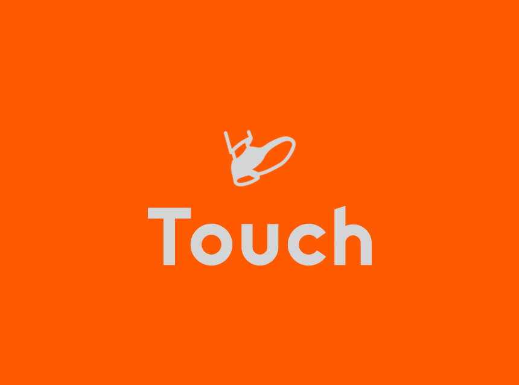

<!-- PROJECT LOGO -->
<br />
<p align="center">
  <a href="https://github.com/YunusEmreAlps/Touch/tree/master/touch">
    
  </a>

  <h3 align="center">Touch</h3>

  <p align="center">
    Touch Other Lives With Your Steps
    <br />
    <a href="https://github.com/YunusEmreAlps/Touch/tree/master/touch">Download</a>
    ·
    <a href="https://github.com/YunusEmreAlps/Touch/issues">Report Bug</a>
    ·
    <a href="https://github.com/YunusEmreAlps/Touch/issues">Request Feature</a>
  </p>
</p>


<!-- TABLE OF CONTENTS -->
<details open="open">
  <summary>Table of Contents</summary>
  <ol>
    <li>
      <a href="#about-us">About Us</a>
    </li>
    <li>
      <a href="#about-the-project">About The Project</a>
      <ul>
        <li><a href="#built-with">Built With</a></li>
      </ul>
    </li>
    <li>
      <a href="#getting-started">Getting Started</a>
      <ul>
        <li><a href="#prerequisites">Prerequisites</a></li>
        <li><a href="#clone">Clone</a></li>
      </ul>
    </li>
    <li><a href="#usage">Usage</a></li>
    <li><a href="#roadmap">Roadmap</a></li>
    <li><a href="#contributing">Contributing</a></li>
    <li><a href="#contact">Contact</a></li>
    <li><a href="#Screenshots">Screenshots</a></li>
  </ol>
</details>


<!-- ABOUT US -->
## About Us

Touch was founded on a dream of creating a global consumer technology company from Konya. We started our journey in 2021 with the vision of planting seeds for the future.

Our goal at Touch is to gather people with high capabilities, strong values and a will to shape Touch’s story. To start realising our big dreams, we choose social network as our first and main area of focus. Social network is one of the few truly universal activities that transcends age, gender or nationality and we believe with the right product, we could reach billions of people worldwide.


<!-- ABOUT THE PROJECT -->
## About The Project
Touch is a mobile donation application with the motto "Touch Other Lives with Your Steps", which encourages walking with the motivation of donations and charity. You have an available balance and you can use this balance for petition and charity. But Touch is not a pedometer or social app. This is a real game.
Because gamification, accessibility, and technology in the donation are necessary now more than ever. As you take a step, you will solve a problem in the background and enjoy secure donations with blockchain technology.
We give prizes to the users who donate the most. if you are not the most donor user don't worry because you can earn XP by doing the given task and reach a new level.  The user will watch ads after each donation. In this way, we are planning to fund the awards.

1. Sign In / Sign Up
2. Walk!
3. Donate Your Steps (Your steps can food, water, sapling, education objects, a signature for a campaign, etc...)
4. Watch the ad and complete your donation
5. Earn XP by doing the given task like Pokemon Go and reach a new level or be the most donator and earn a prize. (Prizes can be swag kit, t-shirt, etc...)

- Touch Presentation Video [YouTube](https://www.youtube.com/watch?v=MbCTpABnHm0)


### Built With

* [Flutter](https://flutter.dev)
* [Firebase](https://firebase.google.com)
* [Google Maps](https://cloud.google.com/maps-platform)


<!-- GETTING STARTED -->
## 🚀 Getting Started

### Prerequisites

To run any Android application built with Flutter you need to configure the enviroments in your machine, you can do this following the the tutorial provided by Google in [Flutter website](https://flutter.dev/docs/get-started/install)

- Flutter SDK
- Android Studio (to download Android SDK)
- Xcode (for iOS develop only)
- Any IDE with Flutter SDK installed (ie. IntelliJ, Android Studio, VSCode etc)
- A little knowledge of Dart and Flutter

### Clone

- Clone this repo to your local machine using:

```
git clone https://github.com/YunusEmreAlps/Touch.git
```

### Setup

To run the app you need to have an online emulator or a plugged device and run the following command in the root of the application (touch-flutter/app)

#### Android
```
flutter run
``` 
### iOS (_MAC Only_)

```
flutter run
``` 

<!-- ROADMAP -->
## Roadmap

See the [open issues](https://github.com/YunusEmreAlps/Touch/issues) for a list of proposed features (and known issues).


<!-- CONTRIBUTING -->
## 🤔 Contributing

Contributions are what make the open source community such an amazing place to be learn, inspire, and create. Any contributions you make are **greatly appreciated**.

1. Fork the Project
2. Create your Feature Branch (`git checkout -b feature/AmazingFeature`)
3. Commit your Changes (`git commit -m 'Add some AmazingFeature'`)
4. Push to the Branch (`git push origin feature/AmazingFeature`)
5. Open a Pull Request


<!-- LICENSE -->
## 📝 License

Distributed under the MIT License. See `LICENSE` for more information.


<!-- CONTACT -->
## 📌 Contact

- Linkedin at [Yunus Emre Alpu](https://www.linkedin.com/in/yunus-emre-alpu-5b1496151/)

<!-- SCREENSHOTS -->
## Screenshots

Splash Screen               |  Welcome Page               | Welcome Page               |  Welcome Page
:-------------------------:|:-------------------------:|:-------------------------:|:-------------------------:
||||

Login Page              |  Forgot Password Page               | OTP Page               |  Signup Page
:-------------------------:|:-------------------------:|:-------------------------:|:-------------------------:
||||

Login Success Page              |  Home Page               | Home Page               |  Contact Part
:-------------------------:|:-------------------------:|:-------------------------:|:-------------------------:
||||

About Us              |  Contact Details              | Suggestions               |  Donations Page
:-------------------------:|:-------------------------:|:-------------------------:|:-------------------------:
||||

Donations Page             |  Leaderboard Local        | Leaderboard Global               |  Task Page 
:-------------------------:|:-------------------------:|:-------------------------:|:-------------------------:
||||

Total Balance           |  Health           | Badges               |  Settings
:-------------------------:|:-------------------------:|:-------------------------:|:-------------------------:
||||